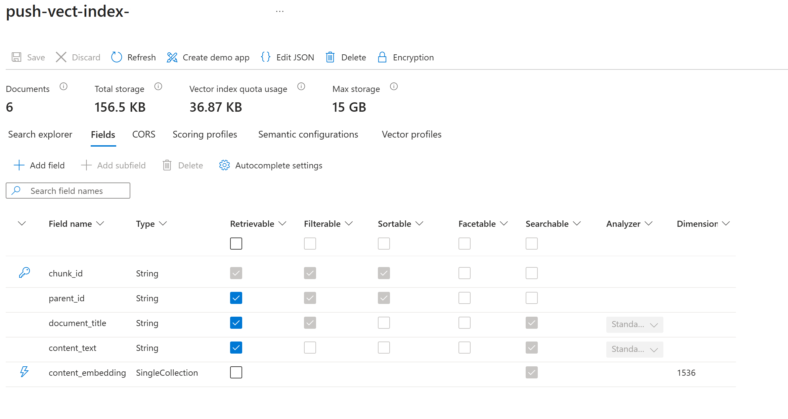
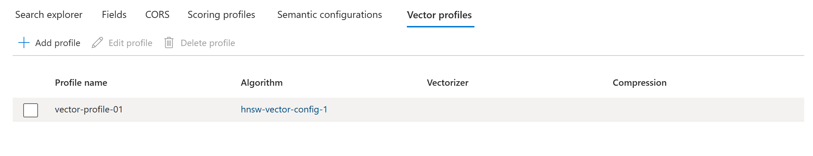
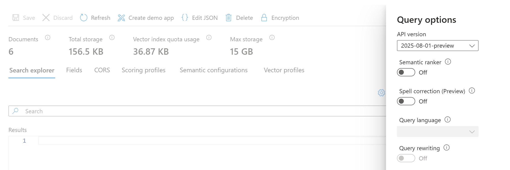
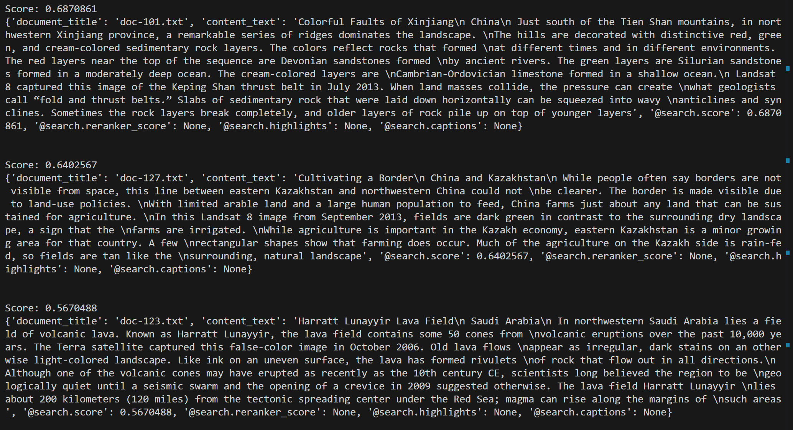

# Azure AI Search: build your vector index using different embeddings models
Azure AI Search offers integrated vector database capabilities, enabling vector search alongside traditional keyword search and filtering within the same service. And typically you would use Azure AI Search as your retriver in the RAG architecture. 
When building your vector index and pushing data into it you'll need to generate embeddings (vector representation). And for the embeddings you can leverage models deployed in Azure AI Foundry (text-embedding-3-small, text-embedding-3-large, text-embedding-ada-002) or on GPU (ex bge-m3) or hosted elsewhere.
The code provides 2 ways to interact with Azure AI Search via search sdk or via REST Endpoint.

## Integrate Azure AI Search using azure search sdk
Use folder "use_sdk" for that. Sample data is provided in "data" folder, note that this is a collection of small txt documents for testing purpose. All the preprocessing including ocr, chunking etc shall be implemented separately and is not in scope for this repo. 

| File name | Comments |
| :--- | ---: |
| embeddings.py | File creates embedding for the text fragment, leverages openai sdk.|
| prep_data.py | File reads the provided txt files, generates embeddings, return a collection of processed documents to be pushed to Azure AI Search.|
| index_mgmt.py | Index management operations: list all indexes, get stats for specific index, delete index.|
| push_strategy_sdk.py | Create index using sdk, push prepared data into index. Examples of vector and hybrid queries.|

For the embeddings generation you can use models from Azure AI Foundry (ex. text-embedding-3-small) or deployed on GPU (BAAI/bge-m3) or others. 
It is important to note that dimensions of your vector field in the search index schema should correspond to dimensions returned by embedding model. Update "vector_dimensions" value for this.
For text-embedding-3-small in the example is 1536 dimensions, for BAAI/bge-m3 it is less - 1024.

With the code following index is created.

Note that as we don't create vectorizer when creating the Index, it will not be possible to use vector search in portal. However vector & hybrid search with code will work.  

In the example there is also vector and hybrid query. The result for vector query looks like:  

## Create your ENV file
Create .env.search file with following values
- EMBEDDING_EDP=your-embeddings-endpoint
- EMBEDDING_KEY=api-key-embeddings
- EMBEDDING_MODEL_NAME=embeddings-model-name
- AI_SEARCH_SERVICE="https://your-search.search.windows.net"
- AI_SEARCH_APIKEY_MGMT=your-ai-search-mgmt-key
- AI_SEARCH_APIKEY_QUERY=your-ai-search-query-key
- AI_SEARCH_API_VERSION="2025-09-01"
- AI_SEARCH_INDEX_NAME=your-search-index-name

## Preparation:
1. Create your Azure AI Search resource and get API keys
2. Deploy your embeddings model and get endpoint + api key. 

## References:
1. Vector Store https://learn.microsoft.com/en-us/azure/search/vector-store
2. Vector Search https://learn.microsoft.com/en-us/azure/search/vector-search-overview
3. Hybrid Search https://learn.microsoft.com/en-us/azure/search/hybrid-search-overview
4. Collection of examples https://github.com/Azure-Samples/azure-search-python-samples/blob/main/Quickstart-Vector-Search/vector-search-quickstart.ipynb
5. python sdk references https://learn.microsoft.com/en-us/python/api/azure-search-documents/azure.search.documents.searchclient?view=azure-python 
6. python sdk references https://learn.microsoft.com/en-us/python/api/azure-search-documents/azure.search.documents.indexes.searchindexclient?view=azure-python
7. Index management https://learn.microsoft.com/en-us/azure/search/search-how-to-manage-index?tabs=list-python%2Cstats-python%2Cdefinition-python%2Cdelete-python&pivots=azure-sdks 
8. Search Client https://learn.microsoft.com/en-us/python/api/azure-search-documents/azure.search.documents.searchclient?view=azure-python